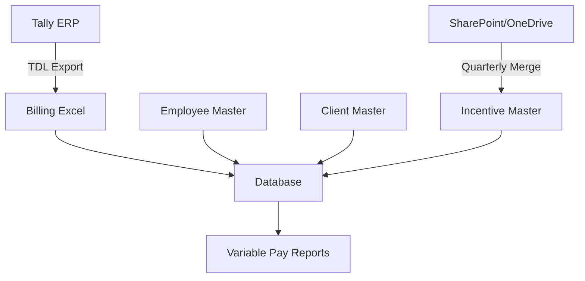

# Variable Pay Automation System for FC Team

## Overview
This system automates the calculation and reporting of variable pay for the entire FC (Financial Consulting) Team. The solution integrates Excel Online documents with a backend database to streamline the incentive calculation process.

## Data Architecture

### Dataset Maintenance
The system maintains four core datasets:

1. **Employee Master** (`employee_master`)
   - Updated monthly by Accounts Team
   - Contains base employee information and incentive parameters

2. **Client Master** (`client_master`)
   - Updated monthly by Accounts Team
   - Requires Business Head approval for changes
   - Maintains audit log of all modifications

3. **Billing Data** (`billing`)
   - Automated feed via TDL (Tally Definition Language) construct
   - Source: Tally ERP system
   - Updated in real-time

4. **Incentive Master** (`incentive_master`)
   - Decentralized input from employees
   - Stored as multiple files in SharePoint/OneDrive
   - Consolidated quarterly through automated merge process

## Workflow Process

### Approval Matrix
Partner → Practice Head → CEM → Trainee


### Data Flow


## File Management

### Incentive Submission Process
1. Employees submit individual incentive files in standardized format
2. Files stored in designated SharePoint folders:
   ```
   /Incentive_Submissions/
   ├── Q1_2023/
   ├── Q2_2023/
   └── Q3_2023/
   ```
3. System automatically merges files at quarter-end

### File Naming Convention
`[EmployeeID]_[Quarter]_[FinancialYear].xlsx`  
Example: `FC0038_Q2_FY25.xlsx`

## Technical Implementation

### Backend Schema
```sql
-- Core tables shown in schema diagram
-- Additional tables for audit logging:
CREATE TABLE change_log (
    id INT AUTO_INCREMENT PRIMARY KEY,
    table_name VARCHAR(50) NOT NULL,
    record_id INT NOT NULL,
    changed_by VARCHAR(100) NOT NULL,
    change_type ENUM('CREATE','UPDATE','DELETE') NOT NULL,
    change_details JSON,
    changed_at TIMESTAMP DEFAULT CURRENT_TIMESTAMP
);
```

### Automation Features
- **Monthly Data Validation Checks**
- **Quarterly Incentive Calculation Jobs**
- **Automated Approval Workflow Notifications**
- **Audit Trail for All Master Data Changes**

## Access Control

| Role | Access Level |
|------|--------------|
| Accounts Team | Read/Write - Master files |
| Business Heads | Approvals Only |
| Employees | Incentive submission only |
| Partners | Full approval authority |

## Change Management
All modifications to master data require:
1. Submission via standardized form
2. Dual approval (Accounts Team + Business Head)
3. Automatic audit log entry

## Reporting
Automated quarterly reports generated in three formats:
1. PDF (Executive Summary)
2. Excel (Detailed Breakdown)
3. Power BI (Interactive Dashboard)
```
